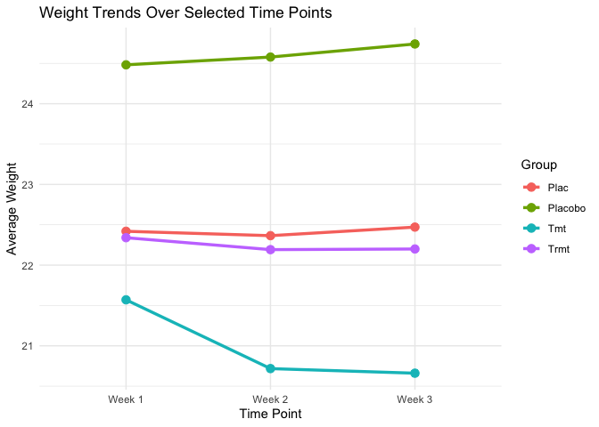

<!-- README.md is generated from README.Rmd. Please edit that file -->

# shilohkira

<!-- badges: start -->
<!-- badges: end -->

shilohkira is a package that makes data fun and easy! The goal of
shilohkira is to help you more efficiently work with any data of your
choice, as well as introduce you to a mortality dataset recording the
death rates across country and other demographics including age and
gender.

With this package, you would be able to interactively work with R
console prompts to filter through and change different values across a
column, as well as to fix non-numeric values to any user inputs and
decisions of your choice. While it’s all up to your discretion, our
package helps you streamline the process.

In addition, our package helps you visualize your data. We help you make
a scatterplot graphing changes over time for different treatment groups,
and another chart plotting changes in weight over time for each sample
you have in the dataset. We also generate a summary statistics table one
for your data so you can get a sense of how your samples change over
time in numerical format as well.

## Installation

You can install the development version of shilohkira like so:

If you were running the folder on your computer locally, open up the
shilohkira folder and run the code `devtools::install()` since this
function essentially replaces the `install.packages("shilohkira")`
function. Then you can run `library(shilohkira)` as usual and you would
be able to use all the different functions in our package!

We also pushed our package onto GitHub, so you would also be able to
install the pacakge from GitHub by running
\`devtools::install_github(“shilohliu0810/shilohkira2”)’.

## Data

We are also introducing you to the [mortality
dataset](https://ghdx.healthdata.org/record/ihme-data/gbd-2010-mortality-results-1970-2010)
in our package. This dataset contains data of mortality by age and sex
across countries over time from 1970-2010, for 187 countries in the
world. This is an important dataset to explore if you want to see how
mortality and death rates, whether as a result as crime, health, or
other factors, vary across countries considering the regions that they
are located and the socioeconomic characteristics comparisons.

It is especially useful to apply our functions to this dataset for
cleaning purposes, and making columns numeric or renaming deviant values
are also functions that are generalizable across all types of data
cleaning. As for plotting purposes, since the mortality dataset is
consisted of two different genders, as with the idea of having a placebo
and treatment group for our sample mouse dataset, we are also able to be
useful in helping you plot differences across these two genders in terms
of mortality rate or death rate trends over time. The time series
component of this dataset also makes it applicable to our package
because we are able to help you plot different countries all on the same
graph for displaying changes over time.

## Functions

# Function 1: check_and_rename_levels

This function allows users to inspect and interactively rename the
levels (unique values) of a specified column in a dataset. It ensures
data consistency by letting users manually correct or standardize the
values in the column.

How It Works: Column Validation: The function first checks if the
specified column exists in the dataset. If the column is missing, the
function stops and throws an error message. Display Unique Values: It
prints all unique values (levels) found in the column, providing an
overview of the data. Interactive Renaming: The user is prompted to
enter new names for each unique value. Pressing “Enter” retains the
original value, allowing flexibility in corrections. The function
replaces the original values in the column with the corrected ones,
based on user input. Return Updated Dataset: Finally, the function
returns the modified dataset with the updated column.

Use Case: This function is particularly useful when dealing with messy
categorical data that requires manual standardization or correction,
such as typos, inconsistent capitalization, or other irregularities.

# Function 2: make_column_numeric_interactive

This function ensures that a specified column in a dataset is converted
to numeric format, even if it contains non-numeric or messy values. It
provides an interactive way for users to handle and clean non-numeric
entries by allowing manual input for corrections.

How It Works: Column Validation: The function first checks if the
specified column exists in the dataset. If the column is missing, it
stops and returns an error. Initial Cleaning: It removes non-numeric
characters (e.g., letters, symbols) from the column to attempt a
conversion to numeric format. Identify Non-Numeric Values: Rows that
cannot be converted to numeric are flagged as NA and presented to the
user for manual resolution. Interactive Resolution: For each flagged
non-numeric value: The user is prompted to either input a valid numeric
replacement or leave the value blank to set it as NA. Invalid inputs are
rejected, ensuring only numeric replacements are made. Update Column:
The cleaned and corrected column is returned in numeric format,
replacing the original in the dataset. Return Updated Dataset: The
modified dataset with the corrected numeric column is returned.

Use Case: This function is particularly useful when working with
datasets that include numeric columns with messy or mixed-format data
(e.g., numbers with special characters, text, or incomplete entries). It
ensures the column is fully numeric and allows user input to handle
ambiguous or unexpected values.

# Function 3: weight_trends

This function creates a line plot to visualize trends in average body
weights over time, grouped by a specified variable (e.g., treatment
groups). It provides flexibility for datasets that may require merging
or reshaping and ensures numeric values for accurate computations.

How It Works: Reshape Data: After validating and making sure that data
is numeric, the dataset is transformed from wide to long format, where
weight measurements across time points are stacked under one column, and
time points are relabeled as factors. Calculate Averages: The function
computes the average weight for each group at each time point, producing
a summary dataset for plotting. Generate Plot: A line plot is created
using ggplot, showing trends in average weights over time, grouped by
the specified grouping variable. Each group is represented by a distinct
color, and points mark individual time points.

Use Case: This function is ideal for visualizing longitudinal data where
trends are tracked across multiple time points, grouped by treatments.

# Function 4: summary_table

This function generates a summary table of descriptive statistics for
body weight measurements across different groups and time points. It
provides insight into the central tendency and variability of weight
data, making it a powerful tool for analyzing grouped longitudinal data.

How It Works: Reshape Data: The dataset is transformed into a long
format, where each time point is treated as a row. Time points are
relabeled with user-defined labels (e.g., “Week 1”, “Week 2”). Calculate
Summary Statistics: The function calculates the following statistics for
each group at each time point: mean, median, standard deviation, count.
Return Table: A neatly formatted summary table is returned, showing the
calculated statistics for each group and time point.

Use Case: This function is ideal for creating a detailed summary of
trends across groups and time points. It is particularly useful for
statistical reporting and exploring patterns in longitudinal studies.

# Function 5: wrong_num

This function identifies potential anomalies in body weight data across
multiple time points for each ID and visualizes the trends using an
interactive scatter plot. The purpose is to highlight any unusual weight
entries or patterns, enabling users to spot and address data issues
effectively.

How It Works: Reshape Data: The dataset is transformed into a long
format, where each weight measurement is stacked as a separate row. Time
points are relabeled with user-specified labels (e.g., “Week 1”, “Week
2”). Interactive Visualization: The function generates an interactive
scatter plot using the plotly library. Each line represents the weight
trend for a specific ID across time points. Points represent individual
weight measurements, making it easy to spot anomalies or irregularities.
Hovering over a point displays detailed information, including ID,
weight, and time point. The interactive plot allows users to identify
outliers, missing values, or unexpected trends in the weight data for
further investigation.

Use Case: This function is ideal for exploratory data analysis (EDA) in
longitudinal studies, where tracking individual trends over time is
crucial. It helps detect: Outliers (e.g., unusually high or low
weights), Missing or incorrect data entries, Irregular patterns that may
warrant further.

## Examples

This is an example for using the `check_and_rename_levels` function to
rename typos in the Birth sheet, using the
`make_column_numeric_interactive` function to make the Birthweight
columns numeric, and generating the weight trend plot using the function
`weight_trends`.

``` r
library(shilohkira)
```

``` r
## basic example code
install.packages("readxl")
#> Installing package into '/private/var/folders/bl/ty38nsqs4334ccr2xpygp5mr0000gp/T/RtmpuF2RYI/temp_libpath707664ed8d28'
#> (as 'lib' is unspecified)
#> 
#> The downloaded binary packages are in
#>  /var/folders/bl/ty38nsqs4334ccr2xpygp5mr0000gp/T//RtmpDwgY9r/downloaded_packages
library(readxl)
library(tidyverse)
#> ── Attaching core tidyverse packages ──────────────────────── tidyverse 2.0.0 ──
#> ✔ dplyr     1.1.4     ✔ readr     2.1.5
#> ✔ forcats   1.0.0     ✔ stringr   1.5.1
#> ✔ ggplot2   3.5.1     ✔ tibble    3.2.1
#> ✔ lubridate 1.9.3     ✔ tidyr     1.3.1
#> ✔ purrr     1.0.2
#> ── Conflicts ────────────────────────────────────────── tidyverse_conflicts() ──
#> ✖ dplyr::filter() masks stats::filter()
#> ✖ dplyr::lag()    masks stats::lag()
#> ℹ Use the conflicted package (<http://conflicted.r-lib.org/>) to force all conflicts to become errors
sheet_names <- excel_sheets("data-raw/mousedata.xlsx")
all_sheets <- lapply(sheet_names, function(sheet) {
  read_excel("data-raw/mousedata.xlsx", sheet = sheet)
})
#> New names:
#> • `Date Body Weight 2` -> `Date Body Weight 2...5`
#> • `Date Body Weight 2` -> `Date Body Weight 2...7`
names(all_sheets) <- sheet_names
Birth <- all_sheets[[1]]    
Bodyweight <- all_sheets[[2]] 
Outcome <- all_sheets[[3]]  

newBirth <- check_and_rename_levels(Birth, "Treatment")
#> [1] "Unique values in the column:"
#> [1] "Plac"    "Placobo" "Tmt"     "Trmt"   
#> Enter the new name for each value. Press Enter if you want to keep the original:
#> Current value: Plac --> 
#> Current value: Placobo --> 
#> Current value: Tmt --> 
#> Current value: Trmt --> 
#> [1] "Renaming complete."
Bodyweight2 <- make_column_numeric_interactive(Bodyweight, "Body Weight 2")
#> No non-numeric values found in the column.
Bodyweight <- make_column_numeric_interactive(Bodyweight, "Body Weight 3")
#> The following non-numeric values were found in the column: Body Weight 3 
#> Row 31 : Current value = Dead 
#> Enter a numeric value to replace this, or leave blank to set it to NA: 
#> Value set to NA.
Bodyweight <- make_column_numeric_interactive(Bodyweight, "Body Weight 1")
#> No non-numeric values found in the column.
weight_trends(
  dataset = newBirth,
  bodyweight_data = Bodyweight2,
  id_col = "ID",
  grouping_col = "Treatment",
  weight_cols = c("Body Weight 1", "Body Weight 2", "Body Weight 3"),
  time_points = c("Week 1", "Week 2", "Week 3"),
  merge_needed = TRUE
)
```

 This is an
example of using the `summary_stats` function on clean data.

``` r
summary_stats <- summary_table(
  dataset = newBirth,
  bodyweight_data = Bodyweight,
  id_col = "ID",
  grouping_col = "Treatment",
  weight_cols = c("Body Weight 1", "Body Weight 2", "Body Weight 3"),
  time_points = c("Week 1", "Week 2", "Week 3"),
  merge_needed = TRUE
)
print(summary_stats)
#> # A tibble: 12 × 6
#>    TimePoint Treatment  Mean Median StdDev Count
#>    <fct>     <chr>     <dbl>  <dbl>  <dbl> <int>
#>  1 Week 1    Plac       22.4   22.3   1.92    14
#>  2 Week 1    Placobo    24.5   24.5  NA        1
#>  3 Week 1    Tmt        21.6   20.7   3.82    14
#>  4 Week 1    Trmt       22.3   22.3  NA        1
#>  5 Week 2    Plac       22.4   22.3   1.93    14
#>  6 Week 2    Placobo    24.6   24.6  NA        1
#>  7 Week 2    Tmt        20.7   20.5   2.68    14
#>  8 Week 2    Trmt       22.2   22.2  NA        1
#>  9 Week 3    Plac       22.5   22.6   1.90    14
#> 10 Week 3    Placobo    24.7   24.7  NA        1
#> 11 Week 3    Tmt        20.7   20.6   2.95    13
#> 12 Week 3    Trmt       22.2   22.2  NA        1
```
